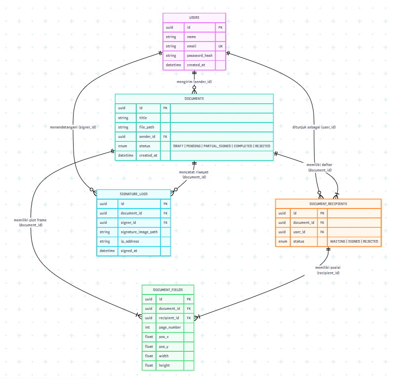

# 🖊️ SignAway — Web Tanda Tangan Digital

**SignAway** adalah platform berbasis web yang dirancang untuk memudahkan proses penandatanganan dokumen PDF secara digital. Dioptimalkan untuk perangkat layar sentuh seperti iPad, tablet desain, maupun desktop, SignAway mendukung alur **Multi-Recipient Document Signing** yang memungkinkan pengirim memplot titik tanda tangan untuk beberapa penandatangan sekaligus (termasuk diri sendiri) dalam satu dokumen.

---

## 🚀 Fitur Utama

- **Canvas Digital Responsif:** Dukungan penuh untuk *Apple Pencil*, *stylus*, dan input sentuh tanpa gangguan *screen scroll*.
- **Multi-Recipient Drag & Drop:** Pengirim dapat memilih penerima tanda tangan (diri sendiri, rekan kerja, atau atasan) dan menempatkan *frame* lokasi tanda tangan masing-masing pada PDF.
- **Workflow & In-App Inbox:** Sistem notifikasi dan daftar masuk (*inbox*) dokumen yang memerlukan tindakan penandatanganan dari pihak terkait.
- **PDF Stamping & Locking:** Menempelkan gambar tanda tangan langsung ke berkas PDF secara permanen (*flattening*) setelah seluruh pihak selesai menandatangani.
- **Audit Trail & Keamanan:** Pencatatan alamat IP, *timestamp*, dan identitas penandatangan untuk integritas dokumen.

---

## 🛠️ Tech Stack

Platform ini dibangun menggunakan arsitektur modern berbasis **TypeScript & Next.js** (terinspirasi dari platform open-source *Documenso*):

- **Framework:** [Next.js](https://nextjs.org/) (App Router, React 19)
- **Bahasa:** [TypeScript](https://www.typescriptlang.org/)
- **Styling & UI:** [Tailwind CSS](https://tailwindcss.com/) + [shadcn/ui](https://ui.shadcn.com/)
- **Database & ORM:** PostgreSQL + [Prisma ORM](https://www.prisma.io/)
- **PDF Engine (Frontend):** `pdfjs-dist` / `react-pdf`
- **PDF Stamping (Backend):** `pdf-lib`
- **Canvas Tanda Tangan:** `signature_pad`
- **Autentikasi:** Auth.js (NextAuth)
- **Layanan Email:** Resend / Nodemailer

---

## 🗄️ Entity Relationship Diagram (ERD)

Berikut adalah struktur hubungan antar-tabel dalam sistem **SignAway**:

    erDiagram
    USERS ||--o{ DOCUMENTS : "mengirim (sender)"
    USERS ||--o{ DOCUMENT_RECIPIENTS : "ditunjuk sebagai (user)"
    USERS ||--o{ SIGNATURE_LOGS : "menandatangani (signer)"

    DOCUMENTS ||--|{ DOCUMENT_RECIPIENTS : "memiliki daftar penerima"
    DOCUMENTS ||--|{ DOCUMENT_FIELDS : "memiliki plot frame TTD"
    DOCUMENTS ||--o{ SIGNATURE_LOGS : "mencatat log audit"

    DOCUMENT_RECIPIENTS ||--|{ DOCUMENT_FIELDS : "memiliki posisi frame"

    USERS {
        uuid id PK
        string name
        string email UK
        string password_hash
        datetime created_at
    }

    DOCUMENTS {
        uuid id PK
        string title
        string file_path
        uuid sender_id FK
        enum status "DRAFT | PENDING | PARTIAL_SIGNED | COMPLETED | REJECTED"
        datetime created_at
    }

    DOCUMENT_RECIPIENTS {
        uuid id PK
        uuid document_id FK
        uuid user_id FK
        enum status "WAITING | SIGNED | REJECTED"
    }

    DOCUMENT_FIELDS {
        uuid id PK
        uuid document_id FK
        uuid recipient_id FK
        int page_number
        float pos_x
        float pos_y
        float width
        float height
    }

    SIGNATURE_LOGS {
        uuid id PK
        uuid document_id FK
        uuid signer_id FK
        string signature_image_path
        string ip_address
        datetime signed_at
    }

📦 Struktur Repositori

    signaway/
    ├── prisma/
    │   └── schema.prisma        # Schema Database (User, Document, Recipient, Field, Log)
    ├── public/
    │   └── uploads/              # Penyimpanan dokumen lokal (Development)
    ├── src/
    │   ├── app/                  # Next.js App Router (Pages & API Routes)
    │   │   ├── api/              # Endpoint API (Upload, Sign, Stamp, Auth)
    │   │   ├── dashboard/        # Halaman Dashboard & Inbox Dokumen
    │   │   └── sign/[id]/        # Halaman Drag & Drop & Tanda Tangan (Optimized for iPad)
    │   ├── components/           # Komponen UI (Canvas, PDFViewer, Modal, Forms)
    │   └── lib/                  # Helper functions (pdf-lib, prisma client)
    ├── .env.example
    ├── package.json
    └── README.md
